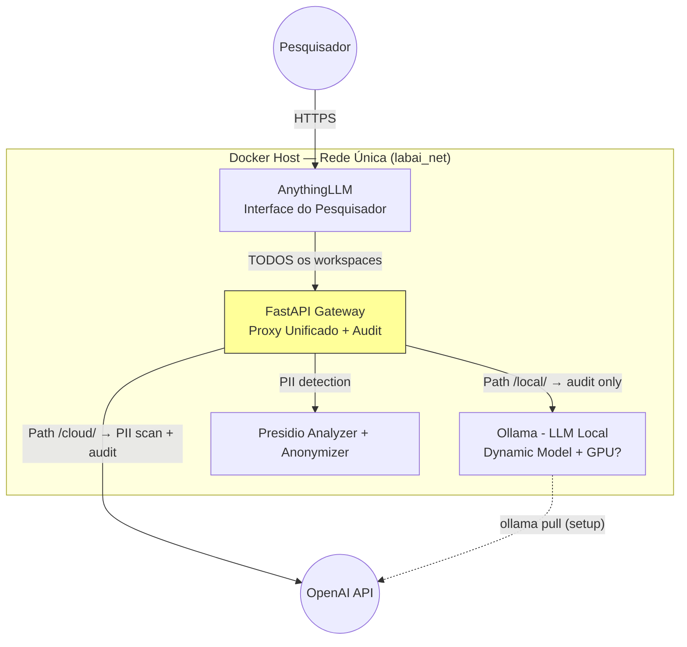
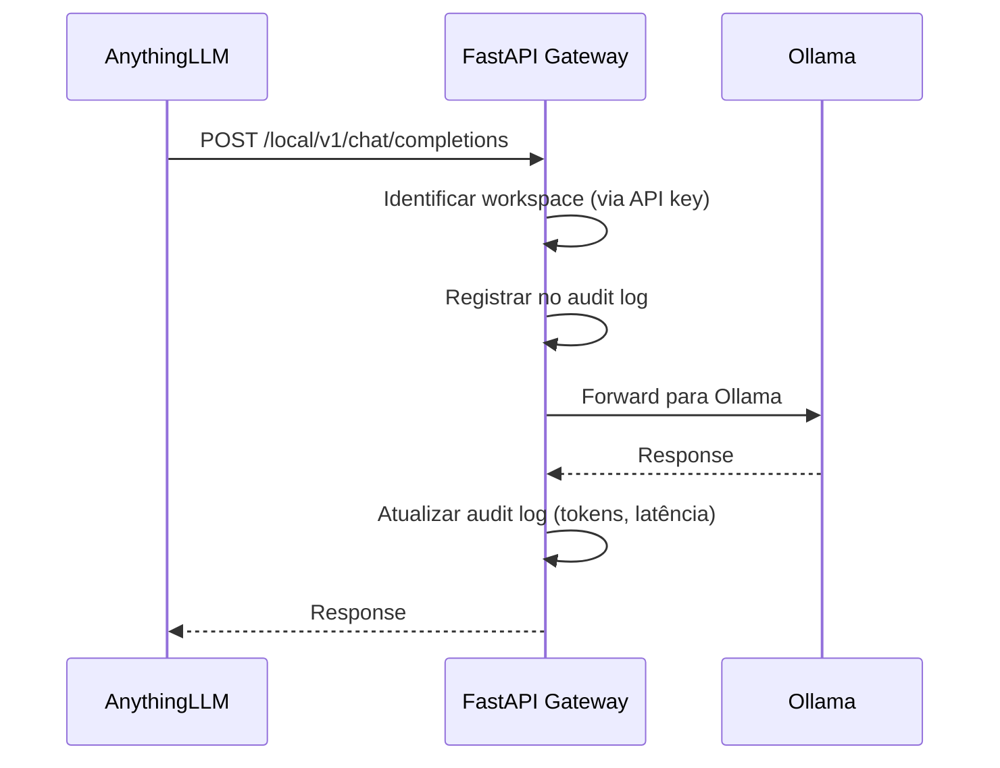
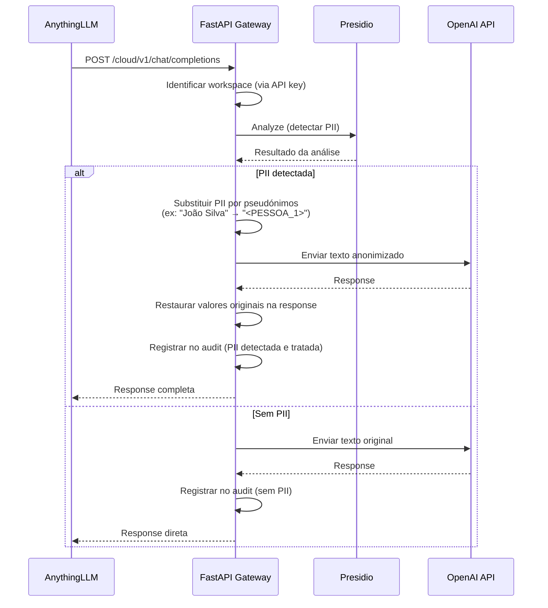

# PRD: LabAI-Comply - Infraestrutura de IA para Pesquisa Científica (v4.1)

> **v4.1 Changelog:** Correções para conformidade com Portaria CNPq 2.664/2026 (Art. 9º, I, c). Gateway como proxy unificado (local + cloud) com audit completo. Workspaces organizados por finalidade/fase da pesquisa. Relatório exportável com campos exigidos pela Portaria.

## 1. Visão Geral

Coleção Ansible (`labai.comply`) que provisiona um ambiente de IA para pesquisa científica em conformidade com o CNPq (Portaria 2.664/2026). O sistema fornece aos pesquisadores uma ferramenta útil (RAG local + acesso a LLMs cloud) com rastreabilidade automática para relatórios de uso de IA.

**Modelo de ameaças:** O pesquisador pode usar qualquer ferramenta externa (ChatGPT, celular, laptop pessoal). O valor do LabAI-Comply não é impedir isso — é ser a ferramenta que o pesquisador **escolhe usar** porque é melhor, mais conveniente, e já gera os registros necessários para o CNPq.

**Componentes:** AnythingLLM (Interface/RAG) · Ollama (LLM Local dinâmico) · Microsoft Presidio (Detecção de PII) · FastAPI Gateway (Proxy unificado com rastreabilidade)

**Princípios:**
1. **Utilidade primeiro** — A ferramenta deve ser melhor que usar ChatGPT diretamente.
2. **Transparência** — Todo uso de IA é registrado automaticamente para relatório CNPq (Art. 9º, I, c).
3. **Conveniência** — PII scanning automático como feature, não como bloqueio.
4. **Sem isolamento forçado** — Rede única, sem complexidade de dual network.

**Conformidade CNPq (Art. 9º, I, c):** O pesquisador deve *"declarar o uso de ferramentas de IAG, de qualquer espécie e em qualquer fase do desenvolvimento da pesquisa, especificando a ferramenta utilizada e a finalidade"*. O LabAI-Comply atende isso registrando automaticamente **quando**, **qual ferramenta/modelo** e **com que finalidade** o pesquisador usou IA — para ambos os caminhos (local e cloud).

## 2. Requisitos de Infraestrutura do Host

| Requisito | Mínimo | Recomendado |
|:---|:---|:---|
| **SO** | Ubuntu 22.04 LTS | Ubuntu 22.04 LTS |
| **vCPUs** | 4 | 8+ |
| **RAM** | 8 GB | 32 GB+ |
| **Disco em `/opt`** | 20 GB livres | 50 GB+ livres |
| **GPU (opcional)** | NVIDIA driver 525+ | RTX 3090 / A100 24 GB+ |
| **Acesso** | SSH com sudo | SSH com sudo |

Se RAM < 8 GB ou disco em `/opt` < 20 GB: o playbook **aborta** com mensagem clara.

## 3. Sistema de Seleção Dinâmica de LLM

### 3.1. Lógica de Descoberta

1. **RAM:** `ansible_memtotal_mb` → `ram_available = total - 4096` (reservado para SO)
2. **GPU:** `nvidia-smi --query-gpu=memory.total --format=csv,noheader,nounits` (`ignore_errors: true`)
3. **Disco:** Espaço livre em `/opt` via `df`
4. **CPU:** `ansible_processor_vcpus` → `num_parallel = max(2, floor(ram_available / (model_ram × 1.3)))`

### 3.2. Matriz de Modelos

Apresentada ao operador via `ansible.builtin.pause`, filtrada pelo hardware detectado. Quantização padrão: `Q4_K_M`.

| Perfil | RAM Disponível | VRAM | Opções (Ollama Tag) | Disco |
|:---|:---|:---|:---|:---|
| **Básico (CPU)** | 8–16 GB | N/A | `llama3.2:3b-instruct-q4_K_M` / `gemma2:2b-instruct-q4_K_M` | ~2–4 GB |
| **Padrão (CPU)** | 16–32 GB | N/A | `llama3.1:8b-instruct-q4_K_M` / `qwen2.5:14b-instruct-q4_K_M` | ~5–9 GB |
| **Avançado (CPU)** | 64 GB+ | N/A | `qwen2.5:32b-instruct-q3_K_M` / `mixtral:8x7b-instruct-q4_K_M` | ~20–26 GB |
| **GPU Entry** | 16 GB+ | 8 GB | `llama3.1:8b-instruct-q4_K_M` / `qwen2.5:14b-instruct-q4_K_M` | ~5–9 GB |
| **GPU Mid** | 32 GB+ | 12–16 GB | `qwen2.5:32b-instruct-q4_K_M` / `command-r:35b-instruct-q4_K_M` | ~20–22 GB |
| **GPU High** | 64 GB+ | 24 GB+ | `llama3.1:70b-instruct-q4_K_M` / `qwen2.5:72b-instruct-q4_K_M` | ~40–42 GB |

> **Nota:** "Avançado (CPU)" usa `Q3_K_M` intencionalmente para comportar modelos 32B em RAM.

### 3.3. Modo Headless

```bash
ansible-playbook labai.comply.setup_lab \
  --extra-vars "headless=true ollama_model_selected=qwen2.5:14b-instruct-q4_K_M"
```

Pula o menu interativo, valida se o hardware suporta o modelo escolhido.

### 3.4. Validação de Disco

Antes de `ollama pull`: comparar tamanho estimado do modelo com espaço livre em `/opt`. Abortar se insuficiente.

### 3.5. Variáveis de Decisão

| Variável | Exemplo |
|:---|:---|
| `ollama_model_selected` | `qwen2.5:14b-instruct-q4_K_M` |
| `ollama_ram_limit` | `26g` |
| `ollama_gpu_enabled` | `true` / `false` |
| `ollama_num_parallel` | Calculado por §3.1 |
| `ollama_keep_alive` | `30m` |

## 4. Arquitetura

### 4.1. Rede

**Rede única** (`labai_net`). Todos os containers na mesma rede Docker bridge.

```
Rede: labai_net (bridge, 172.20.0.0/16)
├── Ollama (porta 11434)           — LLM local
├── Presidio Analyzer (porta 5002) — Detecção de PII
├── Presidio Anonymizer (porta 5001) — Anonimização de PII
├── FastAPI Gateway (porta 8000)   — Proxy unificado + audit
└── AnythingLLM (porta 3000)       — Interface do pesquisador
```

### 4.2. Princípio: Gateway como Proxy Unificado

**Todo acesso a IA passa pelo Gateway.** Isso garante que TODO uso é auditado — tanto local (Ollama) quanto cloud (OpenAI) — atendendo o Art. 9º, I, c da Portaria CNPq ("de qualquer espécie").

O Gateway tem dois modos de proxy:

| Path do Gateway | Roteia para | PII Scanning | Audit |
|:---|:---|:---|:---|
| `/local/v1/chat/completions` | Ollama | Não (dados ficam local) | ✅ Sim |
| `/cloud/v1/chat/completions` | OpenAI | ✅ Sim (via Presidio) | ✅ Sim |

AnythingLLM NÃO se conecta diretamente ao Ollama nem ao OpenAI. Todos os workspaces usam "Generic OpenAI" apontando para o Gateway, em um dos dois paths.

### 4.3. Diagrama de Fluxo



### 4.4. Pipeline Local (Gateway → Ollama)

Para workspaces com dados sensíveis. O Gateway apenas loga e repassa — sem PII scanning, já que os dados ficam local.



### 4.5. Pipeline Cloud (Gateway → PII Scan → OpenAI)

Para workspaces de literatura/revisão. O Gateway detecta PII antes de enviar para a cloud.



### 4.6. Fail-Open Policy

O Gateway opera em modo **fail-open** — a ferramenta deve continuar útil mesmo com componentes degradados:

| Componente Down | Path | Comportamento | Mensagem ao Pesquisador |
|:---|:---|:---|:---|
| Presidio | Cloud | Envia sem scanning de PII | "⚠️ Verificação de PII indisponível. Considere usar o workspace local." |
| OpenAI API | Cloud | Retorna erro ao client | Erro padrão |
| Ollama | Local | Retorna erro ao client | Erro padrão |
| Gateway | Ambos | Sistema indisponível | N/A — pesquisador não pode usar a ferramenta |

### 4.7. Pseudonimização (Path Cloud)

Design simplificado — objetivo é preservar contexto para o LLM, não segurança criptográfica:

**Token format:** `<{TIPO}_{SEQ}>` (ex: `<PESSOA_1>`, `<CPF_1>`, `<LOCAL_1>`)

**Mapping store:** Dicionário em memória, escopo por requisição, descartado após response.

**Restauração na resposta:** Buscar tokens na resposta e substituir pelos valores originais. Se o LLM modificar o token (ex: "a pessoa mencionada"), não restaurar — seguro por omissão.

**Streaming:** Suportado. Buffer de tokens parciais com timeout de 5s. Tokens completos são substituídos imediatamente.

### 4.8. Audit Log — Rastreabilidade CNPq (Art. 9º, I, c)

O audit log é o mecanismo central para que o pesquisador cumpra o Art. 9º, I, c da Portaria CNPq: declarar **quando** usou IA, **qual ferramenta**, e **com que finalidade**.

#### 4.8.1. Workspace Registry

O Gateway mantém um registro que mapeia cada workspace (identificado pela API key usada pelo AnythingLLM) para seus metadados de conformidade:

```yaml
workspace_registry:
  "ws-analise-dados":
    api_key: "key-analise-001"
    finalidade: "análise e processamento de dados"
    fase_pesquisa: "análise de dados"
    provider: "ollama"
    model: "{{ ollama_model_selected }}"
    path: "/local"

  "ws-concepcao":
    api_key: "key-concepcao-001"
    finalidade: "concepção e planejamento da pesquisa"
    fase_pesquisa: "concepção"
    provider: "openai"
    model: "gpt-4"
    path: "/cloud"

  "ws-redacao":
    api_key: "key-redacao-001"
    finalidade: "redação e revisão de texto"
    fase_pesquisa: "redação"
    provider: "openai"
    model: "gpt-4"
    path: "/cloud"

  "ws-revisao-literatura":
    api_key: "key-revisao-001"
    finalidade: "revisão bibliográfica e pesquisa de literatura"
    fase_pesquisa: "concepção"
    provider: "openai"
    model: "gpt-4"
    path: "/cloud"

  "ws-submissao":
    api_key: "key-submissao-001"
    finalidade: "formatação e preparação para submissão"
    fase_pesquisa: "submissão"
    provider: "openai"
    model: "gpt-4"
    path: "/cloud"
```

> O pesquisador pode criar workspaces adicionais via AnythingLLM. Workspaces não registrados no registry ainda são logados com `finalidade: "não especificada"` e `fase_pesquisa: "não especificada"`. O operador pode adicioná-los ao registry posteriormente via `--extra-vars`.

#### 4.8.2. Formato do Audit Log

JSON Lines (`/var/log/gateway/audit.jsonl`). Cada entrada registra uma interação completa:

```json
{
  "timestamp": "2025-01-15T10:30:00Z",
  "request_id": "a3f1b2c4",
  "user": "maria.silva@lab.edu.br",
  "workspace": "ws-redacao",
  "finalidade": "redação e revisão de texto",
  "fase_pesquisa": "redação",
  "provider": "openai",
  "model_used": "gpt-4",
  "action": "chat_completion",
  "pii_detected": true,
  "pii_types": ["PERSON", "BR_CPF"],
  "pii_count": 3,
  "tokens_in": 150,
  "tokens_out": 200,
  "latency_ms": 450
}
```

Campos obrigatórios por requisito da Portaria:

| Campo | Portaria CNPq | Descrição |
|:---|:---|:---|
| `timestamp` | "quando" | Data e hora do uso |
| `model_used` + `provider` | "ferramenta utilizada" | Qual modelo e provedor |
| `finalidade` | "a finalidade" | Propósito do uso |
| `fase_pesquisa` | "(concepção, redação, análise de dados, submissão)" | Fase da pesquisa |
| `user` | — | Quem usou (para relatório individual) |

#### 4.8.3. Relatório Exportável CNPq

O pesquisador pode gerar um relatório para incluir em suas declarações de uso de IA em artigos, relatórios e submissões.

**Endpoints:**

| Endpoint | Descrição |
|:---|:---|
| `GET /audit/usage?from=YYYY-MM-DD&to=YYYY-MM-DD` | Histórico de uso do pesquisador autenticado (JSON) |
| `GET /audit/report?format=csv` | Relatório tabular exportável |
| `GET /audit/report?format=pdf` | Relatório formatado para inclusão em documentos |

**Conteúdo mínimo do relatório (por requisito Art. 9º, I, c):**

| Coluna | Descrição | Exemplo |
|:---|:---|:---|
| Data | Data do uso | 15/01/2025 |
| Ferramenta | Modelo + provedor | GPT-4 (OpenAI) / Qwen2.5 14B (Ollama local) |
| Finalidade | Propósito do uso | Redação e revisão de texto |
| Fase da Pesquisa | Fase em que foi usado | Redação |
| Qtd. Interações | Número de requisições | 12 |
| Tokens (aprox.) | Tokens consumidos | ~3.000 |

**Formato CSV de exemplo (para colar na declaração do artigo):**

```csv
Data,Ferramenta,Finalidade,Fase da Pesquisa,Interações,Tokens (aprox.)
15/01/2025,"Qwen2.5 14B (Ollama local)","análise e processamento de dados","análise de dados",5,1200
15/01/2025,"GPT-4 (OpenAI)","redação e revisão de texto","redação",8,2400
16/01/2025,"GPT-4 (OpenAI)","revisão bibliográfica","concepção",3,900
```

## 5. Estrutura da Coleção Ansible

```text
labai_comply/
├── galaxy.yml
├── playbooks/
│   └── setup_lab.yml
├── roles/
│   ├── hardware_profiling/
│   │   ├── tasks/main.yml
│   │   └── vars/model_matrix.yml
│   ├── system_setup/
│   │   ├── tasks/main.yml
│   │   ├── tasks/docker.yml
│   │   └── tasks/nvidia_toolkit.yml
│   ├── ollama_local/
│   │   ├── tasks/main.yml
│   │   └── defaults/main.yml
│   ├── presidio_guard/
│   │   ├── tasks/main.yml
│   │   └── defaults/main.yml
│   ├── fastapi_gateway/
│   │   ├── tasks/main.yml
│   │   └── defaults/main.yml
│   ├── anythingllm_core/
│   │   ├── tasks/main.yml
│   │   └── defaults/main.yml
│   ├── compliance_audit/
│   │   ├── tasks/main.yml
│   │   └── defaults/main.yml
│   ├── tls_setup/
│   │   └── tasks/main.yml
│   └── backup/
│       ├── tasks/main.yml
│       └── templates/
├── templates/
│   ├── docker-compose.yml.j2
│   ├── gateway_main_py.j2
│   ├── gateway_workspace_registry_yml.j2   # NOVO: workspace → finalidade mapping
│   ├── presidio_analyzer.yml.j2
│   ├── audit_script.sh.j2
│   ├── anythingllm_nginx_conf.j2
│   └── backup_script.sh.j2
└── defaults/
    └── main.yml
```

## 6. Especificação Detalhada dos Roles

### 6.1. `hardware_profiling`

**Tasks:**

1. Coletar `ansible_memtotal_mb`, `ansible_processor_vcpus`, espaço em `/opt`.
2. Detectar GPU NVIDIA via `nvidia-smi` (`ignore_errors: true`).
3. Calcular limites: `ram_available = total - 4096`, `gpu_enabled = vram > 4096`.
4. Validar mínimos: abortar se RAM < 8 GB ou disco < 20 GB.
5. Filtrar modelos viáveis da matriz (`vars/model_matrix.yml`).
6. Apresentar menu interativo (`pause`) ou usar modelo de `--extra-vars` (headless).
7. Validar disco para modelo selecionado.
8. Setar variáveis dinâmicas (`ollama_model_selected`, `ollama_ram_limit`, etc.).

### 6.2. `system_setup`

**Tasks:**

1. **Instalar Docker CE** (`docker-ce`, `docker-ce-cli`, `containerd.io`, `docker-compose-plugin`).
2. **Instalar NVIDIA Container Toolkit** (condicional, se GPU detectada).
3. **Criar rede Docker** `labai_net` (bridge, subnet configurável).
4. **Docker daemon config** (`/etc/docker/daemon.json`):
   - Logging driver `json-file` com `max-size: "10m"`, `max-file: "3"`

### 6.3. `ollama_local`

**Tasks:**

1. **Implantar `ollama/ollama:latest`** na rede `labai_net`.
   - GPU (condicional): `resources.reservations.devices` com `driver: nvidia`.
   - Recursos: `memory: {{ ollama_ram_limit }}`, `cpus: {{ vcpus - 1 }}`.
   - Ambiente: `OLLAMA_NUM_PARALLEL`, `OLLAMA_KEEP_ALIVE: "{{ ollama_keep_alive }}"`.
   - Health check: `curl -f http://localhost:11434/api/tags`.

2. **Pull do modelo:**
   - Executar `docker exec ollama ollama pull {{ ollama_model_selected }}`.
   - Aguardar conclusão com timeout.
   - Verificar com `docker exec ollama ollama list`.

> **Nota:** Ollama é acessado apenas pelo Gateway via path `/local/`, nunca diretamente pelo AnythingLLM.

### 6.4. `presidio_guard`

**Tasks:**

1. **Implantar `presidio-analyzer`** na rede `labai_net`.
   - Imagem customizada com spaCy `pt_core_news_sm`.
   - Recursos: `memory: 2g`.
   - Health check: `curl -f http://localhost:5002/health`.
   - Recognizers customizados montados via volume (CPF, CNPJ, RG, CEP, PHONE_BR).

2. **Implantar `presidio-anonymizer`** na rede `labai_net`.
   - Recursos: `memory: 2g`.
   - Health check: `curl -f http://localhost:5001/health`.

### 6.5. `fastapi_gateway`

**Propósito:** Proxy unificado para TODOS os caminhos de IA. Registra cada interação no audit log com metadados de conformidade CNPq.

**Tasks:**

1. Gerar código a partir de `gateway_main_py.j2`.
2. Gerar `gateway_workspace_registry_yml.j2` com o mapeamento workspace → finalidade.
3. Implantar contêiner FastAPI na rede `labai_net`.
   - Imagem base: `python:3.12-slim`.
   - Recursos: `memory: 1g`, `cpus: 2`.
   - Health check: `curl -f http://localhost:8000/health`.
   - Secret `openai_api_key` via Docker Secret ou env var.
   - Volume: `workspace_registry.yml` + `audit.jsonl`.

4. **Endpoints do Gateway:**

   ```
   === Caminho Local (Ollama) ===
   POST /local/v1/chat/completions
     ├── Identificar workspace via API key → buscar no workspace_registry
     ├── Forward para http://ollama:11434/v1/chat/completions
     ├── Registrar no audit log:
     │   user, workspace, finalidade, fase_pesquisa,
     │   provider="ollama", model=ollama_model_selected,
     │   tokens_in, tokens_out, latency_ms
     └── Retornar response ao AnythingLLM

   === Caminho Cloud (OpenAI) ===
   POST /cloud/v1/chat/completions
     ├── Identificar workspace via API key → buscar no workspace_registry
     ├── Enviar para Presidio Analyzer (detectar PII)
     │   └── Se Presidio down: logar warning, enviar sem modificação
     ├── Se PII detectada (score >= 0.5):
     │   ├── Substituir PII por pseudónimos (<TIPO_SEQ>)
     │   ├── Manter mapping em memória (request-scoped)
     │   └── Enviar texto anonimizado para OpenAI
     ├── Se sem PII ou Presidio indisponível:
     │   └── Enviar texto original para OpenAI
     ├── Receber response (sync ou streaming)
     ├── Restaurar pseudónimos na response (se houver)
     ├── Registrar no audit log:
     │   user, workspace, finalidade, fase_pesquisa,
     │   provider="openai", model, pii_detected, pii_types,
     │   tokens_in, tokens_out, latency_ms
     └── Retornar ao AnythingLLM

   === Audit e Relatórios ===
   GET /health
     └── Status do gateway + conectividade Ollama + Presidio + OpenAI

   GET /audit/usage?from=&to=
     └── Histórico de uso do pesquisador (JSON, filtrado por user)

   GET /audit/report?format=csv
     └── Relatório tabular CNPq (Data, Ferramenta, Finalidade, Fase, Interações, Tokens)

   GET /audit/report?format=pdf
     └── Relatório formatado para inclusão em documentos
   ```

### 6.6. `anythingllm_core`

**Tasks:**

1. **Implantar `mintplexlabs/anythingllm:latest`** na rede `labai_net`.
   - Recursos: `memory: 4g`.
   - Health check: `curl -f http://localhost:3000/api/system`.

2. **Configuração via variáveis de ambiente:**
   ```yaml
   environment:
     OPEN_AI_KEY: ""
     OPENAI_API_BASE_URL: "http://fastapi-gateway:8000/cloud"  # Default — pode ser /local ou /cloud
     EMBEDDING_ENGINE: "local"
     VECTOR_DB: "lancedb"
   ```

3. **Setup pós-deploy:**
   1. Aguardar health check OK.
   2. Criar conta admin (senha forte do vault).
   3. **Criar contas de pesquisadores** — iterar sobre `researchers` (lista passada via `--extra-vars` ou definida no inventory):
      - Para cada item: criar conta via API do AnythingLLM com role padrão (sem admin/manager).
      - Formato: `researchers: [{"name": "Maria Silva", "email": "maria@lab.edu.br"}, ...]`
   4. **Criar workspaces** conforme `workspace_registry` (§4.8.1):
      - Para cada workspace no registry:
        - Criar workspace no AnythingLLM.
        - Configurar LLM Provider como "Generic OpenAI".
        - Configurar endpoint: `http://fastapi-gateway:8000{path}` (ex: `/local` ou `/cloud`).
        - Configurar API key: a `api_key` do workspace no registry.
        - Configurar modelo: conforme `model` no registry.
   5. Desabilitar auto-register de novos usuários.

4. **Aviso de conformidade (Art. 9º, I, e):**
   - Configurar system prompt padrão do AnythingLLM com aviso:
     > *"⚠️ Lembrete: A Portaria CNPq 2.664/2026 veda a inserção de projetos de pesquisa de terceiros em ferramentas de IAG para elaboração de pareceres científicos. Confirme que os documentos que você processa aqui são de sua autoria ou você possui autorização para utilizá-los."*
   - Exibir na página inicial ou como pinned message em cada workspace.

   > **Fallback:** Se a API do AnythingLLM não suportar alguma operação, exibir instruções manuais no output do playbook.

### 6.7. `tls_setup`

**Tasks:**

1. Se `labai_domain` definido: emitir certificado Let's Encrypt via Certbot + renovação automática.
2. Se não definido: gerar certificado auto-assinado + avisar operador.
3. Configurar Nginx como reverse proxy (terminação TLS):
   - Listen 443, proxy para `http://anythingllm:3000`.
   - Headers de segurança (HSTS, X-Frame-Options).

### 6.8. `compliance_audit`

**Tasks:**

1. **Cron job diário** (`audit_script.sh.j2`):
   - Ler `/var/log/gateway/audit.jsonl`.
   - Gerar resumo em `/var/log/gateway/reports/YYYY-MM-DD.json`.
   - Alertar se houver anomalias (volume incomum, falhas repetidas).

2. **Rotação de logs** (logrotate):
   - Semanal, manter 90 dias, compressão após 1 semana.

3. **Retenção:**
   - Audit logs: 90 dias (configurável).
   - Logs Docker: 30 dias.

### 6.9. `backup`

**Tasks:**

1. **Cron job diário** (`backup_script.sh.j2`) às 02:00.
2. **Backup inclui:** AnythingLLM storage, audit logs, config Docker, Nginx/TLS, workspace registry.
3. **Rotação:** 7 diários + 4 semanais + 3 mensais.
4. **Verificação:** Checksum SHA256 pós-backup.

## 7. Variáveis de Configuração

### 7.1. `defaults/main.yml`

```yaml
# === Hardware (calculado dinamicamente) ===
ollama_model_selected: "qwen2.5:14b-instruct-q4_K_M"
ollama_ram_limit: "26g"
ollama_gpu_enabled: false
ollama_num_parallel: 4
ollama_keep_alive: "30m"
headless: false

# === Pesquisadores ===
researchers: []  # [{"name": "Maria", "email": "maria@lab.edu.br"}, ...]

# === Workspace Registry (CNPq Art. 9º, I, c) ===
workspace_registry:
  ws-analise-dados:
    finalidade: "análise e processamento de dados"
    fase_pesquisa: "análise de dados"
    provider: "ollama"
    path: "/local"
  ws-concepcao:
    finalidade: "concepção e planejamento da pesquisa"
    fase_pesquisa: "concepção"
    provider: "openai"
    model: "gpt-4"
    path: "/cloud"
  ws-redacao:
    finalidade: "redação e revisão de texto"
    fase_pesquisa: "redação"
    provider: "openai"
    model: "gpt-4"
    path: "/cloud"
  ws-revisao-literatura:
    finalidade: "revisão bibliográfica e pesquisa de literatura"
    fase_pesquisa: "concepção"
    provider: "openai"
    model: "gpt-4"
    path: "/cloud"
  ws-submissao:
    finalidade: "formatação e preparação para submissão"
    fase_pesquisa: "submissão"
    provider: "openai"
    model: "gpt-4"
    path: "/cloud"

# === Presidio ===
presidio_language: "pt"
presidio_score_threshold: 0.5

# === Gateway ===
gateway_port: 8000
gateway_max_body_mb: 10
gateway_request_timeout: 120

# === TLS ===
labai_domain: ""  # Vazio = auto-assinado

# === Rede ===
labai_subnet: "172.20.0.0/16"

# === Audit ===
audit_retention_days: 90
audit_log_path: "/var/log/gateway/audit.jsonl"

# === Backup ===
backup_dir: "/opt/labai/backups"
backup_ollama_model: false

# === Container Resources ===
presidio_memory_limit: "2g"
gateway_memory_limit: "1g"
anythingllm_memory_limit: "4g"
```

### 7.2. Secrets (Ansible Vault)

```yaml
# vault.yml
openai_api_key: "sk-..."
anythingllm_admin_password: "generated-strong-password"
# API keys por workspace (geradas automaticamente se não fornecidas)
workspace_api_keys:
  ws-analise-dados: "generated-key-001"
  ws-concepcao: "generated-key-002"
  ws-redacao: "generated-key-003"
  ws-revisao-literatura: "generated-key-004"
  ws-submissao: "generated-key-005"
```

## 8. Validação

### 8.1. Testes Automatizados (Playbook)

| # | Teste | Resultado Esperado |
|:---|:---|:---|
| T1 | Gateway PII detection (request com CPF no path `/cloud/`) | PII detectada, pseudonimizada, restaurada na response |
| T2 | Gateway sem PII (request limpa no path `/cloud/`) | Response direta, log marcado "sem PII" |
| T3 | Gateway fail-open (Presidio down, path `/cloud/`) | Request enviada com warning, não bloqueada |
| T4 | Gateway streaming com PII (path `/cloud/`) | Streaming funcional, pseudónimos restaurados |
| T5 | Gateway local proxy (path `/local/` → Ollama) | Response do Ollama, audit log registrado |
| T6 | Health checks (`docker ps`) | Todos os containers `healthy` |
| T7 | Modelo disponível (`ollama list`) | Contém `ollama_model_selected` |
| T8 | TLS (`curl -v https://localhost`) | Conexão TLS estabelecida |
| T9 | GPU (se habilitado, `nvidia-smi` no container) | GPU visível |
| T10 | Audit log completo (local + cloud) | Entradas para ambos os paths com campos CNPq |
| T11 | Contas de pesquisadores | Login funcional com cada conta criada |
| T12 | Relatório CSV (`/audit/report?format=csv`) | CSV com colunas: Data, Ferramenta, Finalidade, Fase, Interações, Tokens |
| T13 | Workspace registry | Gateway mapeia API key → finalidade/fase corretamente |

### 8.2. Testes Manuais

1. **Workspace local:** Enviar chat no "Análise de Dados" — verificar que processou via Ollama (local) e que o audit log registrou `provider: ollama` com `finalidade` e `fase_pesquisa`.
2. **Workspace cloud com PII:** Enviar chat com CPF no "Redação" — verificar anonimização no log e restauração na response.
3. **Relatório CNPq:** Acessar `/audit/report?format=csv` — verificar que contém todas as interações com campos de finalidade e fase.
4. **Aviso de conformidade:** Verificar que o aviso sobre projetos de terceiros aparece nos workspaces.
5. **Backup restore:** Restaurar backup em ambiente limpo.

## 9. Operação

### 9.1. Idempotência

- Skip Docker install se já instalado.
- Skip `ollama pull` se modelo já existe (`ollama list`).
- Docker Compose `up -d` recria apenas se config mudou.
- Skip criação de usuário se já existe.
- Skip criação de workspace se já existe.

### 9.2. Tags

```bash
ansible-playbook setup_lab.yml --tags "ollama,gateway"
ansible-playbook setup_lab.yml --skip-tags "backup"
ansible-playbook setup_lab.yml --tags "ollama" \
  --extra-vars "ollama_model_selected=llama3.1:70b-instruct-q4_K_M"
```

Tags: `hardware`, `system`, `tls`, `ollama`, `presidio`, `gateway`, `anythingllm`, `audit`, `backup`, `validate`.

### 9.3. Atualização

| Componente | Procedimento |
|:---|:---|
| Containers | `docker compose pull && docker compose up -d` |
| Modelo Ollama | Headless mode com novo modelo (§3.3) |
| TLS | Auto-renovação (Let's Encrypt) ou re-run tag `tls` |
| Gateway | Re-run tag `gateway` |
| Pesquisadores | Re-run tag `anythingllm` com nova lista em `researchers` |
| Workspaces | Editar `workspace_registry` + re-run tag `gateway` |

### 9.4. Exemplo de Uso Completo

```bash
# Provisionamento completo
ansible-playbook labai.comply.setup_lab \
  --extra-vars '{
    "researchers": [
      {"name": "Maria Silva", "email": "maria@lab.edu.br"},
      {"name": "João Santos", "email": "joao@lab.edu.br"},
      {"name": "Ana Costa", "email": "ana@lab.edu.br"}
    ],
    "labai_domain": "labai.pesquisa.uf.br"
  }' \
  --vault-password-file ~/.vault_pass

# Adicionar novo workspace personalizado
ansible-playbook labai.comply.setup_lab \
  --tags "gateway,anythingllm" \
  --extra-vars '{
    "workspace_registry": {
      "ws-analise-dados": {
        "finalidade": "análise e processamento de dados",
        "fase_pesquisa": "análise de dados",
        "provider": "ollama",
        "path": "/local"
      },
      "ws-traducao": {
        "finalidade": "tradução de artigos",
        "fase_pesquisa": "redação",
        "provider": "openai",
        "model": "gpt-4",
        "path": "/cloud"
      }
    }
  }'
```
